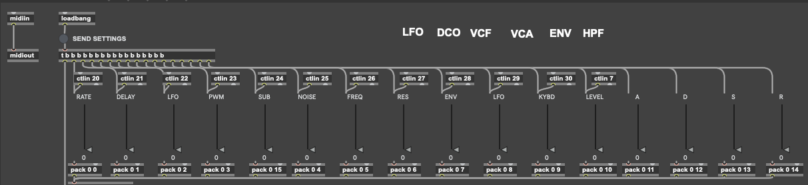

# Juno-106 M4L MIDI instrument

Forked from [https://maxforlive.com/library/device/5053/roland-juno-106-midi-sysex-controller](https://maxforlive.com/library/device/5053/roland-juno-106-midi-sysex-controller)

This modification adds fixed continuous controller (CC) numbers to some of the parameters, allowing the instrument to translate MIDI CCs into the SysEx messages that correspond to the controls on the Roland Juno-106.

The reason for this modification is that, with the current M4L instrument, any 'smooth' automation assigned to any of the controls can overwhelm the MIDI bus and the Juno-106 by sending many thousands of the same message, despite their being only 128 possible values.  
With the addition of the CC inputs, you can use modulation instead of automation which adheres to the 128 values, thereby will only send a MIDI message whenever a value changes, greatly reducing the amount of egress traffic on the MIDI bus.

Credit to [Pibo](https://maxforlive.com/profile/user/Pibo) for the original M4L instrument.

